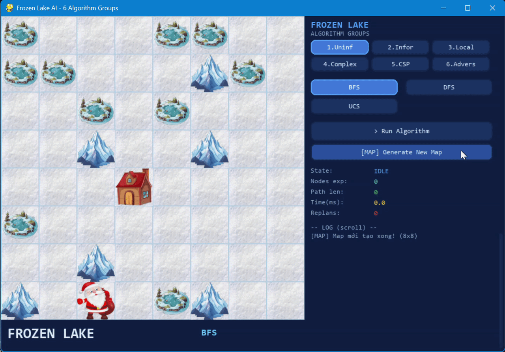

# 🎅 Frozen Lake AI

<p align="center">
  
</p>

<p align="center">
  
  
  
  
</p>

Trò chơi mô phỏng Santa Claus di chuyển trên hồ băng 8×8 để đến ngôi nhà đích, được xây dựng bằng **Python + Pygame** và tích hợp **18 thuật toán AI** thuộc 6 nhóm tìm kiếm khác nhau theo giáo trình AIMA.

---

## 📋 Mục lục

- [Giới thiệu](#-giới-thiệu)
- [Demo](#-demo)
- [Cấu trúc dự án](#-cấu-trúc-dự-án)
- [Cài đặt & Chạy](#-cài-đặt--chạy)
- [Cách chơi](#-cách-chơi)
- [Các thuật toán AI](#-các-thuật-toán-ai)
- [Kiến trúc kỹ thuật](#-kiến-trúc-kỹ-thuật)
- [Tác giả](#-tác-giả)

---

## 🎮 Giới thiệu

**Frozen Lake AI** là một trò chơi đơn giản, trực quan hoá cách AI Agent sử dụng các thuật toán tìm kiếm để giải quyết bài toán tìm kiếm trên lưới.

| Yếu tố | Chi tiết |
|---|---|
| Tác nhân | 🎅 Santa Claus |
| Mục tiêu | 🏠 Đến ngôi nhà đích |
| Chướng ngại | 🕳️ Hố băng &nbsp;·&nbsp; ⛰️ Núi (không thể đi qua) |
| Heuristic | Khoảng cách Manhattan đến đích |
| Bản đồ | Ma trận 8×8, sinh tự động |
| Đối thủ (trong tìm kiếm đối kháng) | 🧝 Satan |

---

## 🎬 Demo

### Giao diện chính

<p align="center">
  
</p>

### Các nhóm thuật toán

| Nhóm | Demo |
|---|---|
| 1 · Uninformed (Breadth-First Search / Depth-First Search / Uniform Cost Search) |  |
| 2 · Informed (Greedy Search/ A\* Search / Iterative Deepening A\* Search) |  |
| 3 · Local (Simple Hill Climbing / Local Beam Search / Simulated Annealing) |  |
| 4 · Complex (Sensorless / Partial-Observation / AND-OR Graph Search) |  |
| 5 · CSP (Forward Checking / AC-3 / Min-Conflicts) |  |
| 6 · Adversarial (Minimax / Alpha-Beta / Expectimax) |  |

---

## 📁 Cấu trúc dự án

```
frozen_lake/
├── main.py               # Điểm khởi động
├── game.py               # Vòng lặp game chính (FrozenLakeGame)
├── environment.py        # Môi trường: Node, transitions, heuristic
├── config.py             # Cấu hình: grid, màu sắc, font, palette thuật toán
├── ui.py                 # Vẽ tile, button, helper Pygame
│
├── algorithms/
│   ├── __init__.py       # Registry: ALGORITHMS dict nhóm 1–6
│   ├── uninformed.py     # BFS · DFS · UCS
│   ├── informed.py       # Greedy · A* · IDA*
│   ├── local.py          # Simple HC · Beam Search · Simulated Annealing
│   ├── complex.py        # Sensorless BFS · Partial-Obs BFS · AND-OR Search
│   ├── csp.py            # Forward Checking · AC-3 · Min-Conflicts
│   └── adversarial.py    # Minimax · Alpha-Beta · Expectimax
│
├── assets/
│   ├── santa.png
│   ├── house.png
│   ├── hole.png
│   ├── mount.webp
│   └── snow.jpg
│
├── images/               # Ảnh & GIF cho README
│
└── README.md             # README cho dự án
```

---

## ⚙️ Cài đặt & Chạy

### Yêu cầu

- Python **3.10+**
- Pygame **2.x**

### Cài đặt

```bash
git clone https://github.com/quocviet171006-gif/frozen_lake.git
cd frozen_lake
pip install pygame
```

### Chạy

```bash
python main.py
```

---

## 🕹️ Cách chơi

| Thao tác | Mô tả |
|---|---|
| **Click tab** 1 → 6 | Chọn nhóm thuật toán |
| **Click tên thuật toán** | Chọn thuật toán cụ thể |
| **▶ Run Algorithm** | Chạy thuật toán đang chọn trên bản đồ hiện tại |
| **🗺 Generate New Map** | Sinh bản đồ mới |

**Panel bên phải** hiển thị:
- Số node đã mở rộng
- Độ dài đường đi
- Thời gian thực thi (ms)
- Log từng bước đi

---

## 🧠 Các thuật toán AI

### Nhóm 1 — Tìm kiếm không có thông tin (Uninformed Search)

<p align="center">
  
</p>

| Thuật toán | Mô tả | Đặc điểm |
|---|---|---|
| **BFS** | Tìm kiếm theo chiều rộng | Tối ưu theo số bước, FIFO queue |
| **DFS** | Tìm kiếm theo chiều sâu | Tốn ít bộ nhớ, LIFO stack |
| **UCS** | Tìm kiếm chi phí đồng nhất | Tối ưu theo cost, priority queue |

---

### Nhóm 2 — Tìm kiếm có thông tin (Informed Search)

<p align="center">
  
</p>

> **Heuristic**: Khoảng cách Manhattan `h(n) = |r - r_goal| + |c - c_goal|`

| Thuật toán | Hàm chi phí | Đặc điểm |
|---|---|---|
| **Greedy** | `h(n)` | Nhanh, không đảm bảo tối ưu |
| **A\*** | `f(n) = g(n) + h(n)` | Tối ưu, admissible heuristic |
| **IDA\*** | `f(n) ≤ threshold` tăng dần | Tiết kiệm bộ nhớ, tìm kiếm lặp sâu |

---

### Nhóm 3 — Tìm kiếm cục bộ (Local Search)

<p align="center">
  
</p>

| Thuật toán | Chiến lược | Tham số |
|---|---|---|
| **Simple Hill Climbing** | Chọn neighbor đầu tiên tốt hơn, dừng ở cực trị cục bộ | — |
| **Local Beam Search** | Duy trì k=2 trạng thái song song | beam width k=2 |
| **Simulated Annealing** | Chấp nhận bước tệ với xác suất `e^(-Δ/T)`, hạ nhiệt dần | T₀=100, Tₘᵢₙ=1, α=0.95 |

---

### Nhóm 4 — Tìm kiếm trong môi trường phức tạp (Complex Environment Search)

<p align="center">
  
</p>

| Thuật toán | Mô hình | Mô tả |
|---|---|---|
| **Sensorless BFS** | Conformant Planning | BFS trên không gian belief state — hoạt động khi không có cảm biến |
| **Partial-Obs BFS** | Partially Observable | BFS có quan sát một phần môi trường |
| **AND-OR Search** | Non-deterministic | Cây AND-OR với môi trường không tất định |

---

### Nhóm 5 — Bài toán thỏa mãn ràng buộc (CSP)

<p align="center">
  
</p>

Nhóm CSP **không tìm đường đi** mà **sinh bản đồ** thỏa mãn ràng buộc:
- Đúng 1 ngôi nhà, đúng 1 Santa
- Tối đa 10 hố, tối đa 6 núi
- Hố không kề ngôi nhà
- Luôn có đường đi từ Santa đến nhà
- Mỗi biến không được đặt quá 1 giá trị

| Thuật toán | Mô tả |
|---|---|
| **Forward Checking** | Backtracking + thu hẹp domain sau mỗi lần gán |
| **AC-3** | Tiền xử lý arc-consistency → sau đó backtrack |
| **Min-Conflicts** | Local search: gán ngẫu nhiên rồi sửa ô vi phạm ràng buộc nhiều nhất |

---

### Nhóm 6 — Tìm kiếm đối kháng (Adversarial Search)

<p align="center">
  
</p>

Mô hình đối kháng trong Frozen Lake:
- **MAX (Santa)**: Muốn đến đích nhanh nhất
- **MIN (Satan)**: Cố gắng ngăn cản Santa đến đích bằng cách bắt lấy Santa

| Thuật toán | Mô tả |
|---|---|
| **Minimax** | Santa tìm nước đi tốt nhất cho mình, Satan tìm nước đi tốt nhất để bắt Santa |
| **Alpha-Beta** | Minimax có cắt tỉa nhánh — hiệu quả hơn |
| **Expectimax** | Satan đi ngẫu nhiên — lấy trung bình các outcomes |

---

## 🏗️ Kiến trúc kỹ thuật

### Môi trường (environment.py)

```
Node(state, parent, cost, action, g, h)
Environment
├── get_cost_transitions(grid, state, goal)  →  [(next_state, cost, action)]
│     cost = 1 (ô thường)
├── heuristic(state, goal)  →  Manhattan distance
└── sensorless_transition(grid, belief, action)  →  frozenset (belief state)
```

### Vòng lặp game (game.py)

```
FrozenLakeGame
├── _instant_map_gen()    →  sinh map ngẫu nhiên
├── _build_ui()           →  khởi tạo 6 tab + buttons
├── run()                 →  vòng lặp Pygame (events → update → draw)
├── _run_algorithm()      →  gọi ALGORITHMS[group][name](grid, start, goal)
└── _animate_step()       →  di chuyển Santa từng bước theo path
```

### Registry thuật toán (algorithms/\_\_init\_\_.py)

```python
ALGORITHMS = {
    1: {"BFS": ..., "DFS": ..., "UCS": ...},
    2: {"Greedy": ..., "A*": ..., "IDA*": ...},
    3: {"Simple HC": ..., "Beam": ..., "Sim Ann": ...},
    4: {"Sensorless": ..., "Partial-Obs": ..., "AND-OR": ...},
    5: {"Forward Check": ..., "AC-3": ..., "Min-Conflicts": ...},
    6: {"Minimax": ..., "Alpha-Beta": ..., "Expectimax": ...},
}
```

### Cấu hình (config.py)

| Hằng số | Giá trị |
|---|---|
| `GRID` | 8 (lưới 8×8) |
| `CELL` | 72 px |
| `PANEL_W` | 380 px (panel bên phải) |
| `FPS` | 60 |
| Tile types | SNOW=0, HOLE=1, MOUNT=2, HOUSE=4 |

---

## 👤 Tác giả

| | |
|---|---|
| **Nhóm 4** | 
| **Thành viên** | Bùi Nguyễn Duy Trung - 24110363|
| | Đỗ Anh Tuấn - 24110369|
| | Nguyễn Quốc Việt - 24110381|
| **Trường** | ĐH Công nghệ Kỹ thuật TP.HCM (HCMUTE) |
| **Môn học** | Trí Tuệ Nhân Tạo |
| **GitHub** | [@quocviet171006-gif](https://github.com/quocviet171006-gif) |

---

> *Tham khảo: Stuart Russell & Peter Norvig — "Artificial Intelligence: A Modern Approach" (4th ed.)*